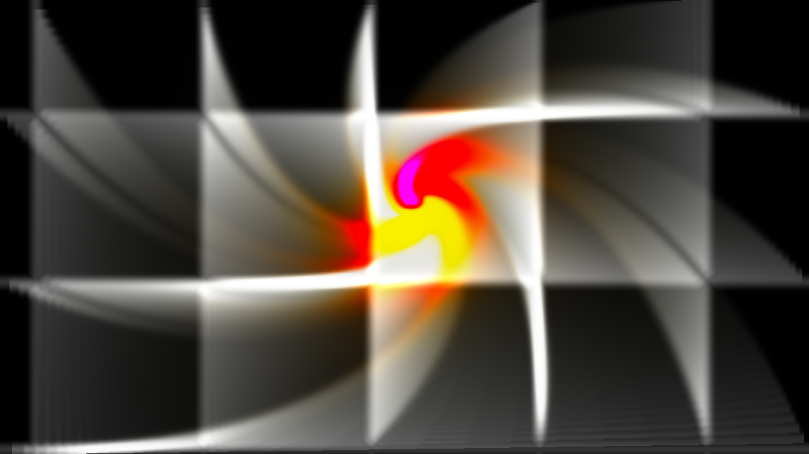

# Escapement user guide

Escapement is **a video feedback rig**, for [Resolume](https://resolume.com) Arena and Avenue as a
pair of FFGL plugins. It models a camera looking at a screen that is showing what the camera saw a
field ago, through glass that splits the light into several paths, with a proc amp in the cable.

The fractals are what that loop settles into. Nothing in it evaluates a fractal.

*The Mirror Tunnel preset. Every edge in it is the frame's own edge, re-photographed.*

> **This is v0.1.4.** The point release changed nothing but the Windows installer, which no
> longer touches the system PATH. The tap sets are checked against their published constants —
> Sierpinski's three maps contract by exactly 0.500, Koch's four by 0.333, the Heighway dragon's
> two by 0.707, and Barnsley's first map is confirmed singular, as published. Sixty trips round
> the loop produce a bit-identical frame whether they arrive as sixty frames of one or one frame
> of sixty. Four hundred fields of a deliberately hostile rig leave no NaN and the rig still
> draws afterwards. All twelve presets draw structure and are still moving once settled, and all
> 46 controls change the picture.
>
> **Both plugins load and run in Resolume Arena 7.27.1, on macOS and on Windows.** The shipped
> Windows build is checked in a real Arena: each registers with the right name, uid and category,
> all 52 controls the host reports match the ones declared — name, order, type, range and default
> — and 47 of them demonstrably move the picture. That check runs on software rendering, so it
> says nothing about an NVIDIA or AMD driver, and nothing here has yet run on a discrete GPU other
> than one Apple Silicon Mac. Try it on a spare layer first.
>
> **Fixed in v0.1.3: choosing a preset now sticks.** In v0.1.2 the dropdown snapped straight
> back to Custom the moment you picked anything, and the preset never applied. Resolume keeps
> pushing the values it still believes in, and the plugin was reading that as you having moved
> a slider. Every preset is now checked against all three things a host can do with the values
> a preset writes — honour them, ignore them, or hand back a rounded copy — and that check runs
> on every build.
>
> This codebase was created with AI assistance, directed and reviewed by a human author.

---

## Installing

Both plugins are in every download. Drop them into `~/Documents/Resolume Arena/Extra Effects` (or
the Avenue equivalent) and restart Resolume — it scans that folder at startup only.

| | |
|---|---|
| **Escapement** | A source. A rig with nothing in front of the lens but what it makes itself. |
| **Escapement Feed** | An effect. Your clip in front of the lens — injected *into* the loop, so the fractal is built out of the footage. |

There is no OpenFX build. Escapement's picture is the whole history of its loop, and an OpenFX host
renders arbitrary frames in arbitrary order, which is a question a feedback rig cannot answer.

---

## The one thing to understand

**A rig with every knob held still goes still.** That is not a fault to be tuned out — it is what
the plugin is. The loop is a contraction mapping, so it converges on its attractor and then maps
that attractor onto itself for ever. Zooming does not help either: a self-similar attractor
magnified is the same attractor.

Real rigs never settle because a person is always moving the cameras. **Drift** is that person, and
it is on by default in every preset. Turn it to zero once and watch a rig die, because that is the
clearest possible explanation of what everything else here is doing.

---

## The controls that matter

**Gain** is the one the whole plugin is about, because it has a threshold in it. Below unity every
trip round the loop is dimmer than the last and the picture decays into whatever is being injected.
Above unity it grows until the clip stage stops it, and *the shape it grows into is the attractor*.
Unity sits at exactly 0.625 of the slider's travel, so you can find it in the dark.

**Drift** moves the operator's hands — slowly, at rates with no common multiple, so it never
repeats. Its depth is scaled by how stiff the rig is: a nudge that visibly moves a mirror rig does
nothing at all to a Sierpinski, which contracts by two and shrugs it off.

**Hue Rotate** is the difference between a picture and a performance. With it at zero the loop
converges to a fixed point. With a little it cannot, because a fixed point would have to be a
colour that is its own rotation, so the structure keeps re-entering itself and the colour walks the
wheel for ever. Two thousandths of a turn per field is plenty.

**Inject Level is food, and too much of it is what makes a rig ugly.** Above unity the
attractor sustains itself, so the grain is only there to give the loop something to converge
from as Drift moves it. Turn it up and two things go wrong at once: the loop's half-finished
copies of the frame — the transients it is still working on, which are rectangles, because the
frame is a rectangle — get bright enough to read as boxes behind the picture, and the attractor
itself runs into the clip and loses its structure. If a rig looks like a white blob sitting on
faint grey boxes, that is this, and the fix is less grain rather than more gain. v0.1.2 retuned
Sierpinski, Koch, Dragon and Seeded for exactly this.

**Focus** is a lens that is slightly soft, and it is *inside* the loop — a low-pass filter inside a
feedback loop is what stops a hot rig collapsing into single-pixel noise. Sharp and hot is static;
soft and hot is what everyone recognises as video feedback. It is measured as a fraction of the
frame, so a preset looks the same on your preview and on a 4K output.

**Zoom below 1 gives you the tunnel.** A feedback tunnel is made of the screen's own edge,
re-photographed, so the camera has to be able to see *past* the frame — which means pulling back,
not pushing in. Above 1:1 you get expanding blooms instead, which is a different and also good
thing.

**Saturation above 1 is a reaction term, not a colour choice.** Chroma gain over one amplifies
whatever colour a pixel has, Focus spreads it to its neighbours, and the clip stops it: that is a
reaction-diffusion system, and its domains are colours. It is the whole of the Cell Structures
preset. Below 1.0 the same rig collapses to a dot.

**Field Rate** is the rig's own clock, not Resolume's. The picture evolves at the same speed
whether the host is managing 60 fps or dropping to 24.

---

## The rigs

The first seven are **tap sets**. A tap is one path from the screen back into the camera; a set of
taps is an iterated function system, and the fractal is its attractor. `Sierpinski` really is three
affine maps, and the gasket assembles itself out of sensor noise.

| Rig | What it is |
|---|---|
| **Mirror** | One tap. A camera and a screen, which is the whole classic rig. |
| **Sierpinski** | Three half-scale taps on a triangle. The gasket. |
| **Koch** | Four third-scale taps. With Symmetry at 3 it is the snowflake. |
| **Dragon** | Two taps at 1/√2. The Heighway dragon. |
| **Fern** | Barnsley's four maps. One of them is singular — it is the stem, which is a line and not an area — so the loop drops it and the stem is missing. |
| **Kaleidoscope** | A mirror wedge: N unit-scale rotations. The camera's zoom is the *only* contraction here, so pushing it past 1:1 whites the picture out. |
| **Seeded** | A rig built from a number. Every seed is framed, because a seeded attractor's bounds are measured rather than assumed. |
| **Julia**, **Mandelbrot** | The iterator bank — analogue multipliers wired as a complex square. The only part of the plugin that holds a coordinate, and so the only part with a precision limit. |
| **Globe** | The rescan: the rig's screen is a sphere and the camera is looking at it. The loop underneath keeps running, so the texture on the globe is alive rather than a still that spins. |

**Symmetry** is a mirror wedge in front of the lens. It is how the snowflake is made from a Koch
*curve*: four taps plus a three-fold fold, for the cost of one coordinate wrap instead of the eight
extra taps the twelve-map snowflake system would need.

---

## Endless zoom, and where it ends

For every rig except the two escape-time ones, the zoom is **genuinely unlimited**. The camera's
zoom is a per-field multiplier applied to the picture, not a coordinate anyone stores, so after a
thousand fields at 1.02 the magnification is 1.02¹⁰⁰⁰ — a number that never exists anywhere in the
plugin. There is nothing to overflow. Leave it running for an hour.

Julia and Mandelbrot do hold a coordinate, so they have the limit the others do not. Single
precision runs out around 1e5. **Extended** uses double-float arithmetic to reach about 1e13, for
roughly three times the cost, and a starved iteration count looks exactly like a precision failure
— both render a flat field — so raise **Iterations** before suspecting the arithmetic.

---

## Using it as an effect

`Escapement Feed` takes your clip. Set **Inject** to `Clip` and the footage goes *into* the loop
rather than behind the picture, so the attractor is built out of its light and keeps developing
after the clip has moved on. **Mask Mode** and **Mix** decide how the result meets the original.

With Inject on anything else, the effect ignores the clip and renders its own rig over it — which
is a legitimate thing to want, and is what the defaults do.

---

## Credit

The rig this models is real: **The Light Herder**'s 4K Video Feedback Fractal Device — cameras, 4K
screens, half-mirrored glass and analogue knobs, with the operator as part of the loop. Its video
is [here](https://youtu.be/koDCabeh5kQ), and the claim in its description — *fractals without a
computer* — is this plugin's entire architecture.

MIT licensed. Source, issues and downloads at
[github.com/stoatworks-labs/escapement](https://github.com/stoatworks-labs/escapement).
